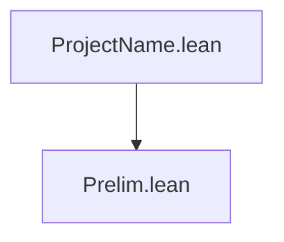
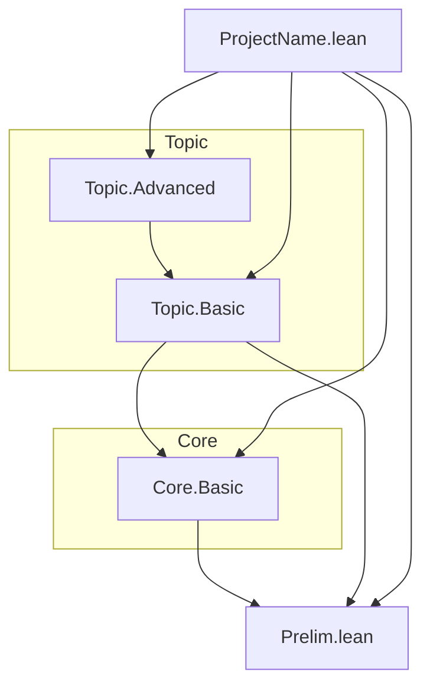

# Diagrama de Dependencias — ProjectName

**Última actualización:** YYYY-MM-DD HH:MM
**Autor**: [Nombre del Autor]

> **Cuándo este fichero deja de ser útil tal cual**: pasado cierto tamaño (la
> experiencia de proyectos hermanos sitúa el umbral en torno a 40-50 módulos), un
> grafo módulo-a-módulo se queda desactualizado casi de inmediato y mantenerlo exige
> regenerarlo por completo en cada sesión — coste que deja de compensar. Si tu
> proyecto ha cruzado ese umbral:
>
> 1. Sustituye (o complementa) el grafo módulo-a-módulo de abajo por una **vista de
>    nivel de subsistema** (capas: qué subsistema depende de qué subsistema, no qué
>    fichero depende de qué fichero) — esa vista no se desactualiza al añadir módulos
>    dentro de una capa ya existente.
> 2. Añade una nota explícita de alcance histórico como esta, indicando desde cuándo el
>    grafo detallado ya no es exhaustivo, y remite a `REFERENCE.md` (§1, la tabla de
>    módulos) o a `lake graph` para el grafo completo y al día.
> 3. **No borres el grafo antiguo ni mientas sobre su vigencia** — una nota honesta de
>    "esto documenta solo la fase inicial" es preferible a dejarlo pasar por completo
>    y actualizado cuando no lo es.

---

## Vista de Nivel de Subsistema (opcional, recomendada a partir de ~40 módulos)

Diagrama estable de dependencias entre subsistemas (las flechas indican "depende de").
A diferencia del grafo módulo-a-módulo de abajo, esta vista no se desactualiza al
añadir módulos dentro de una capa ya existente.

```text
(ejemplo — sustituir por las capas reales del proyecto)
Prelim/  ──►  Core/  ──►  Nat/  ──►  Algebra/
                                        │
                          ┌─────────────┤
                          ▼             ▼
                     GroupTheory/   Topology/
```

---

## Estructura del Proyecto

```text
ProjectName/
├── Prelim.lean         # Definiciones preliminares
├── _template.lean      # Plantilla de módulo (no se importa)
├── Core/                # (ejemplo de subdirectorio)
│   └── Basic.lean
└── Topic/               # (ejemplo de subdirectorio)
    ├── Basic.lean
    └── Advanced.lean
ProjectName.lean        # Módulo raíz
```

## Grafo de Dependencias (módulo a módulo)



*(Actualizar este diagrama a medida que se añaden módulos. Para más de ~15 nodos,
agrupar por subdirectorio con `subgraph`:)*



## Jerarquía de Namespaces

### 1. **ProjectName** (raíz)

```lean
-- ProjectName.lean importa todos los módulos
```

### 2. **ProjectName.Prelim**

```lean
namespace ProjectName.Prelim
  -- Definiciones preliminares
```

*(Añadir sub-namespaces a medida que se crean subdirectorios)*

## Dependencias por Nivel

### Nivel 0: Fundamentos

- `Prelim.lean` — sin dependencias

### Nivel 1: Núcleo

- *(módulos que dependen solo de Prelim)*

### Nivel 2: Derivado

- *(módulos que dependen del Nivel 1)*

### Nivel N: Raíz

- `ProjectName.lean` — importa todos los módulos

## Exportaciones por Módulo

### Prelim.lean

```lean
export ProjectName.Prelim (
  -- nombres exportados aquí
)
```

## Tabla resumen de exportaciones (recomendada a partir de ~10 módulos)

| Módulo | # definiciones públicas | # teoremas exportados |
|---|---:|---:|
| `Prelim` | 0 | 0 |

## Notas de Diseño

1. **Separación de responsabilidades**: cada módulo trata un aspecto.
2. **Dependencias mínimas**: importar solo lo estrictamente necesario; `open`
   selectivo.
3. **Exportaciones selectivas**: solo definiciones y teoremas públicos se exportan
   (ver `AI-GUIDE.md` §17).
4. **Sin Mathlib** (ADR-001 en `DECISIONS.md`), salvo que se declare explícitamente lo
   contrario.
5. **Un namespace por módulo**: refleja la ruta del fichero (ver ADR-005).

## Comandos de Verificación

```bash
lake build                        # build completo del proyecto
lake graph                        # grafo de dependencias real y completo (Lake nativo)
bash check-sorry.bash             # comprobar sorry restantes
make status                       # estado de bloqueo + sorry (si el Makefile lo define)
```
