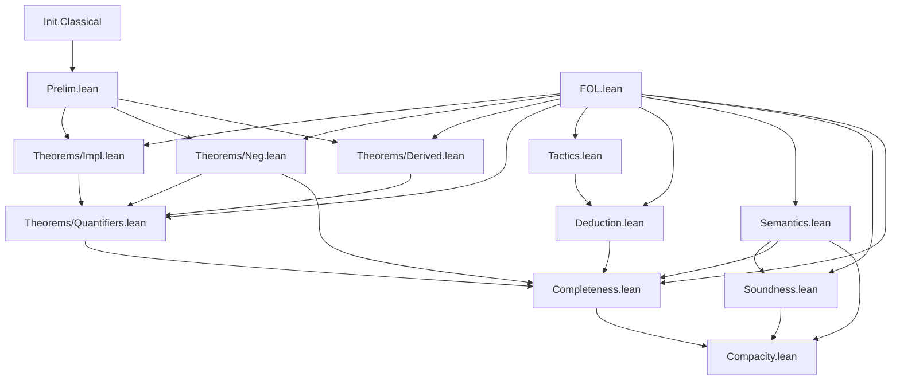

# Technical Reference — ProjectName

**Last updated:** 2026-04-25 22:30
**Author**: Julián Calderón Almendros
**Lean version**: v4.28.0

---

## 0. Naming Conventions Guide for the Reader

This project adopts [Mathlib](https://leanprover-community.github.io/contribute/naming.html)-style naming conventions.
Below are the keys for reading and searching theorems.

### 0.1 Capitalization Rules

- **Theorems/lemmas** (Prop): `snake_case` — `union_comm`, `mem_powerset_iff`
- **Prop definitions** (predicates): `UpperCamelCase` — `IsNat`, `IsFunction`; in theorem names → `lowerCamelCase`: `isNat_zero`
- **Functions** (returning values): `lowerCamelCase` — `powerset`, `union`, `sUnion`
- **Acronyms**: as group — `ZFC` (namespace), `zfc` (in snake_case)

### 0.2 Symbol-to-Word Dictionary

| Symbol | Name | | Symbol | Name | | Symbol | Name |
|--------|------|---|--------|------|---|--------|------|
| ∈ | `mem` | | ∪ | `union` | | + | `add` |
| ∉ | `not_mem` | | ∩ | `inter` | | * | `mul` |
| ⊆ | `subset` | | ⋃ | `sUnion` | | - | `sub`/`neg` |
| ⊂ | `ssubset` | | ⋂ | `sInter` | | / | `div` |
| 𝒫 | `powerset` | | \ | `sdiff` | | ^ | `pow` |
| σ | `succ` | | △ | `symmDiff` | | ∣ | `dvd` |
| ∅ | `empty` | | ᶜ | `compl` | | ≤ | `le` |
| = | `eq` | | ⟂ | `disjoint` | | < | `lt` |
| ≠ | `ne` | | ↔ | `iff` | | 0 | `zero` |
| ¬ | `not` | | → | `of` | | 1 | `one` |

### 0.3 Theorem Name Structure

- **Conclusion first**: `isNat_succ_of_isNat` — conclusion (`isNat_succ`) before hypotheses (`of_isNat`) with `_of_`
- **Biconditionals**: suffix `_iff` — `mem_powerset_iff` (∈ 𝒫 ↔ ⊆)
- **Directions of an iff**: `.mp` (→) and `.mpr` (←) — `mem_powerset_iff.mp`
- **Specifications**: `mem_X_iff` — `mem_succ_iff`, `mem_inter_iff`, `mem_union_iff`

### 0.4 Axiomatic Suffixes

| Suffix | Meaning | | Suffix | Meaning |
|--------|---------|---|--------|---------|
| `_comm` | commutativity | | `_self` | op with itself |
| `_assoc` | associativity | | `_left`/`_right` | lateral variant |
| `_refl` | reflexivity | | `_cancel` | cancellation |
| `_trans` | transitivity | | `_mono` | monotonicity |
| `_antisymm` | antisymmetry | | `_inj` | injectivity (iff) |
| `_symm` | symmetry | | `_injective` | injectivity (pred) |

### 0.5 Naming Migration Status

*(Update this section as the project evolves. Example:)*

✅ **Phase 3 completed** (2026-04-21): Names migrated to Mathlib conventions. All FOL modules follow naming conventions perfectly.

---

## 📋 Compliance with AI-GUIDE.md

This document complies with all requirements specified in [AI-GUIDE.md](AI-GUIDE.md):

✅ **(1)** All `.lean` modules documented in section 1.1
✅ **(2)** Dependencies between modules (table with dependencies column)
✅ **(3)** Namespaces and relationships (table with namespace column)
✅ **(4)** Definitions with location, namespace, and declaration order
✅ **(5)** Axioms and definitions with:

- Human-readable mathematical notation
- Lean 4 signature for code usage
- Explicit dependencies
✅ **(6)** Main theorems without proof with:
- Human-readable mathematical notation
- Lean 4 signature for code usage
- Explicit dependencies
✅ **(7)** Only proven/constructed content (no pending items)
✅ **(8)** Continuous update when loading `.lean` files
✅ **(9)** Self-sufficient as sole reference (no need to load entire project)

---

## 1. Module Overview

### 1.1 Module Table

| Module | Namespace | Dependencies | Status |
|--------|-----------|--------------|--------|
| `Prelim.lean` | top-level | `Init.Classical` | ✅ Completo |
| `FOL.lean` | top-level | none | ✅ Completo |
| `Theorems/Impl.lean` | `FOL.Theorems.Impl` | `FOL.FOL`, `FOL.Prelim` | ✅ Completo |
| `Theorems/Neg.lean` | `FOL.Theorems.Neg` | `FOL.FOL`, `FOL.Prelim` | ✅ Completo |
| `Theorems/Derived.lean` | `FOL.Theorems.Derived`| `FOL.FOL`, `FOL.Prelim` | ✅ Completo |
| `Theorems/Quantifiers.lean` | `FOL.Theorems.Quantifiers`| `FOL.FOL`, `FOL.Theorems.Impl`, `FOL.Theorems.Neg`, `FOL.Theorems.Derived` | ✅ Completo |
| `Tactics.lean` | `FOL.Tactics` | `FOL.FOL`, `Lean` | ✅ Completo |
| `Deduction.lean` | `FOL.Metamath.Deduction` | `FOL.FOL`, `FOL.Tactics` | ✅ Completo |
| `Semantics.lean` | `FOL.Metamath.Semantics` | `FOL.FOL` | ✅ Completo |
| `Soundness.lean` | `FOL.Metamath.Soundness` | `FOL.FOL`, `FOL.Metamath.Semantics`, `FOL.Tactics` | ✅ Completo |
| `Completeness.lean` | `FOL.Metamath.Completeness` | `FOL.FOL`, `FOL.Semantics`, `FOL.Deduction`, `FOL.Theorems.Neg`, `FOL.Theorems.Quantifiers` | ✅ Completo |
| `Compacity.lean` | `FOL.Metamath.Compacity` | `FOL.FOL`, `FOL.Semantics`, `FOL.Soundness`, `FOL.Completeness` | ✅ Completo |

*Status codes*: ✅ Complete · 🧊 Frozen · 🔶 Partial · 🔄 In progress · ❌ Pending

---

## 2. Dependency Graph



*(Update this diagram as modules are added)*

---

## 3. Module Descriptions

### 3.1 Prelim.lean

**Namespace**: top-level (no namespace wrapper)
**Dependencies**: `Init.Classical`
**Last updated**: 2026-04-20 00:00
**Status**: ✅ Completo
**@axiom_system**: `none`
**@importance**: `foundational`

Foundational infrastructure used by all modules: custom `ExistsUnique` with full API,
both `∃!` and `∃¹` notations, dot-notation style and Peano-compatible aliases.

#### ExistsUnique

**Mathematical statement**: p has a unique witness iff ∃ x, p x ∧ ∀ y, p y → y = x

**Lean 4 signature**:

```lean
def ExistsUnique {α : Sort u} (p : α → Prop) : Prop :=
  ∃ x, p x ∧ ∀ y, p y → y = x
```

**Computability**: noncomputable (witness extraction uses `Classical.choose`)
**Dependencies**: `Init.Classical`

**Full API**:

| Name (dot-notation) | Peano alias | Description |
|---------------------|-------------|-------------|
| `ExistsUnique.intro w hw h` | — | constructor |
| `ExistsUnique.exists h` | `ExistsUnique.exists h` | extracts `∃ x, p x` |
| `ExistsUnique.choose h` | `choose_unique h` | noncomputable witness |
| `ExistsUnique.choose_spec h` | `choose_spec_unique h` | witness satisfies p |
| `ExistsUnique.unique h y hy` | `choose_uniq h hy` | uniqueness: `y = witness` |

---

### 3.2 FOL.lean

**Namespace**: top-level
**Dependencies**: none
**Last updated**: 2026-04-21
**Status**: ✅ Completo
**@axiom_system**: `classical`
**@importance**: `foundational`

Provides the core syntax, substitution operations using De Bruijn indices, AST navigation, and the Natural Deduction system with a local rewrite rule mechanism.

**Definitions**:

- `Term`: Inductive type for terms (variables via `#n` and functions).
- `Formula`: Inductive type for formulas (`⊥`, `eq`, `atom`, `⇒`, `∀.`).
- `neg`, `top`, `lor`, `land`, `iff`, `ex`: Derived logical connectives.
- `liftTerm`, `liftTerms`, `liftFormula`: De Bruijn lifting.
- `substTerm`, `substTerms`, `substFormula`: Substitution of De Bruijn indices.
- `Pos`: Abstract Syntax Tree position path for subformula targeting.
- `getAt?`, `replaceAt`: Operations to query and modify formulas at exact positions.
- `LocalRule`: Allows localized rewrites (e.g., double negation elimination).
- `Derives`: Inductive predicate `Γ ⊢ f` representing natural deduction derivations.
  - Includes rules for equality: `eq_refl` and `eq_subst`.

**Notations**:

- `⊥` => `Formula.bottom`
- `⊤` => `top`
- `¬` => `neg`
- ` ≐ ` => `Formula.eq`
- ` ∧ ` => `land`
- ` ∨ ` => `lor`
- ` ⇒ ` => `Formula.impl`
- ` ⇔ ` => `iff`
- `∀.` => `Formula.forall`
- `∃.` => `ex`
- `#` => `Term.var`
- ` ⊢ ` => `Derives`

---

### 3.3 Theorems/Impl.lean

**Namespace**: `FOL.Theorems.Impl`
**Dependencies**: `FOL.FOL`, `FOL.Prelim`
**Last updated**: 2026-04-21
**Status**: ✅ Completo
**@axiom_system**: `none`
**@importance**: `high`

Tautologies of implication.

**Theorems**:

- `id_impl`: $A \Rightarrow A$
  `theorem id_impl {Γ A} : Γ ⊢ .impl A A`
- `k_impl`: $A \Rightarrow (B \Rightarrow A)$
  `theorem k_impl {Γ A B} : Γ ⊢ .impl A (.impl B A)`
- `syllogism_impl`: $(A \Rightarrow B) \Rightarrow ((B \Rightarrow C) \Rightarrow (A \Rightarrow C))$
  `theorem syllogism_impl {Γ A B C} : Γ ⊢ .impl (.impl A B) (.impl (.impl B C) (.impl A C))`
- `s_impl`: $(A \Rightarrow (B \Rightarrow C)) \Rightarrow ((A \Rightarrow B) \Rightarrow (A \Rightarrow C))$
  `theorem s_impl {Γ A B C} : Γ ⊢ .impl (.impl A (.impl B C)) (.impl (.impl A B) (.impl A C))`

---

### 3.4 Theorems/Neg.lean

**Namespace**: `FOL.Theorems.Neg`
**Dependencies**: `FOL.FOL`, `FOL.Prelim`
**Last updated**: 2026-04-21
**Status**: ✅ Completo
**@axiom_system**: `classical`
**@importance**: `high`

Properties of negation, explosion, and contrapositive laws.

**Theorems**:

- `explosion_impl`: $\perp \Rightarrow A$
  `theorem explosion_impl {Γ A} : Γ ⊢ .impl ⊥ A`
- `double_neg_intro`: $A \Rightarrow \neg(\neg A)$
  `theorem double_neg_intro {Γ A} : Γ ⊢ .impl A (neg (neg A))`
- `double_neg_elim`: $\neg(\neg A) \Rightarrow A$
  `theorem double_neg_elim {Γ A} : Γ ⊢ .impl (neg (neg A)) A`
- `contrapositive_1`: $(A \Rightarrow B) \Rightarrow (\neg B \Rightarrow \neg A)$
  `theorem contrapositive_1 {Γ A B} : Γ ⊢ .impl (.impl A B) (.impl (neg B) (neg A))`
- `contrapositive_2`: $(\neg B \Rightarrow \neg A) \Rightarrow (A \Rightarrow B)$
  `theorem contrapositive_2 {Γ A B} : Γ ⊢ .impl (.impl (neg B) (neg A)) (.impl A B)`

---

### 3.5 Theorems/Derived.lean

**Namespace**: `FOL.Theorems.Derived`
**Dependencies**: `FOL.FOL`, `FOL.Prelim`
**Last updated**: 2026-04-21
**Status**: ✅ Completo
**@axiom_system**: `classical`
**@importance**: `high`

Properties of derived connectives ($\land$, $\lor$, $\Leftrightarrow$).

**Theorems**:

- `and_intro`: $A \Rightarrow (B \Rightarrow (A \land B))$
- `and_elim_left`: $(A \land B) \Rightarrow A$
- `and_elim_right`: $(A \land B) \Rightarrow B$
- `or_intro_left`: $A \Rightarrow (A \lor B)$
- `or_intro_right`: $B \Rightarrow (A \lor B)$
- `or_elim`: $(A \lor B) \Rightarrow ((A \Rightarrow C) \Rightarrow ((B \Rightarrow C) \Rightarrow C))$
- `excluded_middle`: $A \lor \neg A$
- `and_comm`: $(A \land B) \Rightarrow (B \land A)$
- `or_comm`: $(A \lor B) \Rightarrow (B \lor A)$
- `and_assoc`: $((A \land B) \land C) \Rightarrow (A \land (B \land C))$
- `or_assoc`: $((A \lor B) \lor C) \Rightarrow (A \lor (B \lor C))$
- `de_morgan_1_fwd`: $\neg(A \lor B) \Rightarrow (\neg A \land \neg B)$
- `de_morgan_1_rev`: $(\neg A \land \neg B) \Rightarrow \neg(A \lor B)$
- `de_morgan_1`: $\neg(A \lor B) \Leftrightarrow (\neg A \land \neg B)$
- `de_morgan_2_fwd`: $\neg(A \land B) \Rightarrow (\neg A \lor \neg B)$
- `de_morgan_2_rev`: $(\neg A \lor \neg B) \Rightarrow \neg(A \land B)$
- `de_morgan_2`: $\neg(A \land B) \Leftrightarrow (\neg A \lor \neg B)$

---

### 3.6 Theorems/Quantifiers.lean

**Namespace**: `FOL.Theorems.Quantifiers`
**Dependencies**: `FOL.FOL`, `FOL.Theorems.Impl`, `FOL.Theorems.Neg`, `FOL.Theorems.Derived`
**Last updated**: 2026-04-21
**Status**: ✅ Completo
**@axiom_system**: `classical`
**@importance**: `high`

Quantifier interactions and dualities.

**Axioms**:

- `subst_lift_cancel_formula`: `substFormula v t (liftFormula (v + 1) f) = f`
- `subst_distrib_and`: `substFormula v t (land A B) = land (substFormula v t A) (substFormula v t B)`
- `lift_distrib_and`: `liftFormula c (land A B) = land (liftFormula c A) (liftFormula c B)`

**Theorems**:

- `forall_dne`: $(\forall x. \neg \neg A) \Rightarrow (\forall x. A)$
- `forall_not_impl_exists_not`: $\neg(\forall x. A) \Rightarrow \exists x. \neg A$
- `forall_dni`: $(\forall x. A) \Rightarrow (\forall x. \neg \neg A)$
- `exists_not_impl_forall_not`: $(\exists x. \neg A) \Rightarrow \neg(\forall x. A)$
- `dual_forall_exists`: $\neg(\forall x. A) \Leftrightarrow \exists x. \neg A$
- `forall_and_impl_and_forall`: $(\forall x. A \land B) \Rightarrow (\forall x. A) \land (\forall x. B)$
- `and_forall_impl_forall_and`: $((\forall x. A) \land (\forall x. B)) \Rightarrow (\forall x. A \land B)$
- `distrib_forall_and`: $(\forall x. A \land B) \Leftrightarrow (\forall x. A) \land (\forall x. B)$

---

### 3.7 Tactics.lean

**Namespace**: top-level
**Dependencies**: `FOL.FOL`, `Lean`
**Last updated**: 2026-04-25
**Status**: ✅ Completo
**@axiom_system**: `none`
**@importance**: `high`

Metaprogramming and macros to automate repetitive natural deduction tasks.

**Tactics**:

- `derive_hyp`: Closes goals of the form `Γ ⊢ f` if `f ∈ Γ` via `Derives.hyp` and `List.Mem` resolution.
- `derive_rewrite rule at pos`: Automates the application of a local rewrite rule `LocalRule` at a specific AST position using `Derives.rewrite_at`.
- `derive_weaken thm`: Automatically weakens a theorem `thm`'s context to the current goal's context by resolving `List.Subset` goals automatically.
- `derive_raa`: Applies the Reductio ad Absurdum (`Derives.raa`) rule to change a goal `Γ ⊢ A` into `Γ, ¬A ⊢ ⊥`.

**Definitions**:

- `getAllPositions`: Extracts all valid path positions (`List Pos`) from a given `Formula`.
- `tryMem`: MetaM tactic to prove list membership automatically.

---

### 3.8 Deduction.lean

**Namespace**: `FOL.Metamath.Deduction`
**Dependencies**: `FOL.FOL`, `FOL.Tactics`
**Last updated**: 2026-04-25
**Status**: ✅ Completo
**@axiom_system**: `classical`
**@importance**: `high`

**Theorems**:

- `deduction_theorem`: $(A :: \Gamma \vdash B) \Rightarrow (\Gamma \vdash A \Rightarrow B)$
  `theorem deduction_theorem {Γ A B} (h : A :: Γ ⊢ B) : Γ ⊢ .impl A B`

---

### 3.9 Semantics.lean

**Namespace**: `FOL.Metamath.Semantics`
**Dependencies**: `FOL.FOL`
**Last updated**: 2026-04-25 20:30
**Status**: ✅ Completo
**@axiom_system**: `classical`
**@importance**: `high`

**Definitions**:

- `Model`: Evaluates logic terms and predicates. `structure Model (D : Type)`
- `evalTerm`: Evaluates a `Term` into the model's domain.
- `evalTerms`: Evaluates a list of terms.
- `shiftEnv`: Shifts De Bruijn variable environment.
- `updateEnv`: Updates variable environment at a specific depth $c$.
- `evalFormula`: Computes the truth value of a `Formula`.
- `contextSatisfies`: Checks if an environment satisfies a context $\Gamma$.
- `satisfies`: $Γ \models f$. `def satisfies (Γ : List Formula) (f : Formula) : Prop`

**Theorems**:

- Substitution & Lifting generalizations: `eval_liftTerm_ext`, `eval_liftTerms_ext`, `eval_substTerm_ext`, `eval_substTerms_ext`, `eval_liftFormula_ext`, `eval_substFormula_ext`.
- Base Semantics Lemmas: `updateEnv_zero`, `shiftEnv_updateEnv_comm`, `eval_liftFormula_zero`, `eval_substFormula_zero`, `contextSatisfies_lift_zero`.
- Rewrite Correctness: `rule_soundness`, `replaceAt_soundness`.

---

### 3.10 Soundness.lean

**Namespace**: `FOL.Metamath.Soundness`
**Dependencies**: `FOL.FOL`, `FOL.Metamath.Semantics`, `FOL.Tactics`
**Last updated**: 2026-04-25
**Status**: ✅ Completo
**@axiom_system**: `classical`
**@importance**: `high`

**Theorems**:

- `soundness`: Si $\Gamma \vdash f$, entonces $\Gamma \models f$.
  `theorem soundness {Γ f} (h : Γ ⊢ f) : Γ ⊨ f`

---

## 4. Theorems

*(See Module Descriptions in §3 for individual theorems).*

---

## 5. Notations

| Symbol | Expands to | Module | Variants |
|--------|-----------|--------|---------|
| `∃! x, p` | `ExistsUnique (fun x => p)` | `Prelim.lean` | untyped only |
| `∃¹ x, p` | `ExistsUnique (fun x => p)` | `Prelim.lean` | `∃¹ x`, `∃¹ (x)`, `∃¹ (x : T)`, `∃¹ x : T` |
| `⊥` | `Formula.bottom` | `FOL.lean` | |
| `⊤` | `top` | `FOL.lean` | |
| `¬` | `neg` | `FOL.lean` | prefix |
| ` ≐ ` | `Formula.eq` | `FOL.lean` | infix |
| ` ∧ ` | `land` | `FOL.lean` | infixr |
| ` ∨ ` | `lor` | `FOL.lean` | infixr |
| ` ⇒ ` | `Formula.impl` | `FOL.lean` | infixr |
| ` ⇔ ` | `iff` | `FOL.lean` | infix |
| `∀.` | `Formula.forall` | `FOL.lean` | prefix |
| `∃.` | `ex` | `FOL.lean` | prefix |
| `#` | `Term.var` | `FOL.lean` | prefix |
| ` ⊢ ` | `Derives` | `FOL.lean` | infix |
| ` ⊨ ` | `satisfies` | `Soundness.lean` | infix |

**Note**: `∃!` overrides Lean's built-in notation. Use `∃¹` to avoid any macro conflicts.

---

## 6. Exports

### 6.1 Prelim.lean

All names are top-level (no namespace), accessible wherever `Prelim.lean` is imported:

```lean
-- Definitions
ExistsUnique                -- Prop-valued predicate

-- Notation
∃! x, p                    -- unique existence (overrides built-in)
∃¹ x, p                    -- unique existence (safe, 4 variants)

-- Dot-notation API
ExistsUnique.intro
ExistsUnique.exists
ExistsUnique.choose         -- noncomputable
ExistsUnique.choose_spec
ExistsUnique.unique

-- Peano-compatible aliases
choose_unique               -- noncomputable
choose_spec_unique
choose_uniq
```

### 6.2 FOL.lean

Top-level definitions:
`Term`, `Formula`, `neg`, `top`, `lor`, `land`, `iff`, `ex`, `liftTerm`, `liftTerms`, `liftFormula`, `substTerm`, `substTerms`, `substFormula`, `Pos`, `getAt?`, `replaceAt`, `LocalRule`, `Derives`.

### 6.3 Theorems/Impl.lean

Exports from namespace `FOL.Theorems.Impl`:
`id_impl`, `k_impl`, `s_impl`, `syllogism_impl`.

### 6.4 Theorems/Neg.lean

Exports from namespace `FOL.Theorems.Neg`:
`explosion_impl`, `double_neg_intro`, `double_neg_elim`, `contrapositive_1`, `contrapositive_2`.

### 6.5 Theorems/Derived.lean

Exports from namespace `FOL.Theorems.Derived`:
`and_intro`, `and_elim_left`, `and_elim_right`, `or_intro_left`, `or_intro_right`, `or_elim`, `excluded_middle`, `and_comm`, `or_comm`, `and_assoc`, `or_assoc`, `de_morgan_1_fwd`, `de_morgan_1_rev`, `de_morgan_1`, `de_morgan_2_fwd`, `de_morgan_2_rev`, `de_morgan_2`.

### 6.6 Theorems/Quantifiers.lean

Exports from namespace `FOL.Theorems.Quantifiers`:
`subst_lift_cancel_formula`, `subst_distrib_and`, `lift_distrib_and`, `forall_dne`, `forall_not_impl_exists_not`, `forall_dni`, `exists_not_impl_forall_not`, `dual_forall_exists`, `forall_and_impl_and_forall`, `and_forall_impl_forall_and`, `distrib_forall_and`.

### 6.7 Tactics.lean

Metaprogramming macros globally registered into the environment:
`derive_hyp`, `derive_rewrite`, `derive_weaken`, `derive_raa`, `getAllPositions`, `tryMem`.

### 6.8 Deduction.lean

Exports from namespace `FOL.Metamath.Deduction`:
`deduction_theorem`.

### 6.9 Semantics.lean

Exports from namespace `FOL.Metamath.Semantics`:
`eval_liftFormula_zero`, `eval_substFormula_zero`, `contextSatisfies_lift_zero`, `rule_soundness`, `replaceAt_soundness`, `updateEnv_zero`, `shiftEnv_updateEnv_comm`.

### 6.10 Soundness.lean

Exports from namespace `FOL.Metamath.Soundness`:
`soundness`.

---

## 7. Documentation Status

### 7.1 Fully Projected Files

- `Prelim.lean`
- `FOL.lean`
- `Theorems/Impl.lean`
- `Theorems/Neg.lean`
- `Theorems/Derived.lean`
- `Theorems/Quantifiers.lean`
- `Tactics.lean`
- `Deduction.lean`
- `Soundness.lean`

### 7.2 Partially Projected Files

- `Semantics.lean` (Awaiting proofs for semantic replacement lemmas)

### 7.3 Notes

*(None)*
